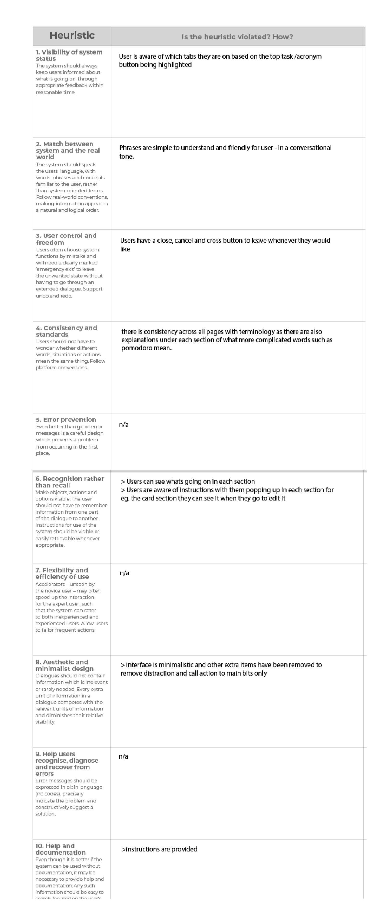

# Design Documentation

The first step was review the feedback I had received from A3 & iterate this into my next steps. 

# Feedback from A2 
  * __Roadmap__, 
  

  * __Design__, to continue working on reiterating the design. 

# Design Iteration Process
* __Usability Testing__, I interviewed 5 participants identifying as ADHD individuals. These users were friends, family members. I showed them my figma prototype and ask them to carry out a series of 4 tasks where I measured the usability, and any notes/observations and asked for feedback. After this they filled out a System Usability Scale, rating basic usability principles. From this feedback I identified, key problems with the design that users found was that the acronym maker was confusing in what it did, some of the tasks were confusing to complete ie. pomodoro as some users didn't know what that was, and some buttons blended in.

* __Iteration 1__, In this iteration, I wanted to ensure I was addressing all the points of the design brief - so the new features I added including adding a column, next to the add task bar so that they are easily distinguisable at the top and accessible to the user. Next I decide to change the colours, as some users gave feedback that red was a bit scary and daunting which defeats the whole purpose of the app - it has to be trustable.I did secondary research into this and colour theory and decided to use blue as this was also consistent with many other websites validating its use in StudBud. 

* __Heuristic Evaluation__, After creating a new iteration - I completed out a heuristic evaluation and reflected on design changes to add in. 

# Challenges
* __Editing a card__ I didn't know how to allow a user to edit a card, as I didn't know where the data would be stored. After doing some research - most websites said that it would go into the backend, however that is out of the scope here. 
* __Pomodoro__ it was hard to set the custom timings. I couldn't work out a simple way to do this and tried to use the modulo method and used maths instead - I know there could be better ways to do this. 

# Reflection
This assignment was challenging being new to javascript. I learnt that sometimes its easy to caught up in the design of features - but the users comes first and a compromise needs to be made ebtween this and whether certain features can actually be codeable. It also provided me great understanding into the importance of a roadmap of functional specification list, as these things need to be taken into consideration when coding. I also learnt to give myself more time and next time would spend more time working on the code - as I wasn't able to implement every feature of code from the prototype I made. In future, I should start earlier and talk reguluary to my tutor about progress, the roadmap and codeable designer - that is my responsiblity as a designer. 

Coming back to designing for the user - it's important to make sure you are desiging for them, which I felt like I was addressing strongly by interviewing and talking to users identifying with ADHD - however I have to acknowledge an unconscious bias being that they are in my circle. In the future I would interview new ADHD identifying users by posting out a survey across various facebook groups. It was hard to actually carry out usability testing as there was no coding on the backend.

# References
Bootstrap. (n.d.). Borders. Retrieved from https://getbootstrap.com/docs/4.0/utilities/borders/
Bootstrap. (n.d.). Cards. Retrieved from https://getbootstrap.com/docs/4.6/components/card/
Bootstrap. (n.d.). Flex. Retrieved from https://getbootstrap.com/docs/4.0/utilities/flex/
Bootstrap. (n.d.). Modal. Retrieved from https://getbootstrap.com/docs/5.0/components/modal/
Bootstrap. (n.d.). Spacing. Retrieved from https://getbootstrap.com/docs/4.0/utilities/spacing/
Bootstrap. (n.d.). Typography. Retrieved from https://getbootstrap.com/docs/4.0/content/typography/
Educative. (n.d.). What is the modulo operator in JavaScript? Retrieved from https://www.educative.io/edpresso/what-is-the-modulo-operator-in-javascript
Momentjs. (n.d.). Moment.js Documentation. Retrieved from https://momentjs.com/docs/
Nielsen, J. (2020). 10 Usability Heuristics for User Interface Design. Retrieved from https://www.nngroup.com/articles/ten-usability-heuristics/
Rehkopf, M. (n.d.). What is a kanban board? Retrieved from https://www.atlassian.com/agile/kanban/boards#:~:text=A%20kanban%20board%20is%20an,order%20in%20their%20daily%20work
https://www.w3schools.com/js/js_arithmetic.asp
SortableJS. (2022). SortableJS. Retrieved from https://sortablejs.github.io/Sortable/
SortableJS. (2022). SortableJS. GitHub. Retrieved from https://github.com/SortableJS/Sortable
Spotify. (n.d.). Embeds. Retrieved from https://developer.spotify.com/documentation/embeds/
Tomitsch, M., Wrigley, C., Borthwick, M., Ahmadpour, N., Frawley, J., Kocaballi, A. B., ... & Straker, K. (2018). Design. think. make. break. repeat. A handbook of methods. Bis Publishers.
tutorialehtml. (n.d.). What is a favicon and how to use it. Retrieved from https://tutorialehtml.com/en/what-is-favicon-ico-usage/
W3schools. (n.d.). JavaScript Arithmetic. Retrieved from https://www.w3schools.com/js/js_arithmetic.asp
W3schools. (n.d.). JavaScript Array includes(). Retrieved from https://www.w3schools.com/jsref/jsref_includes_array.asp

